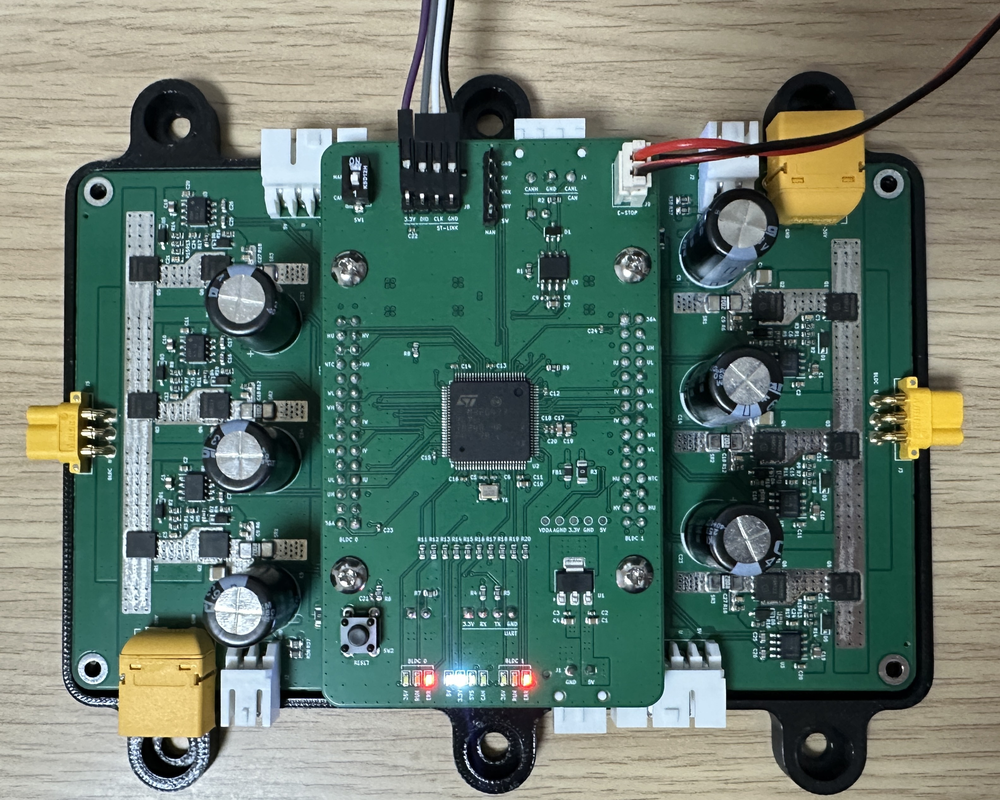
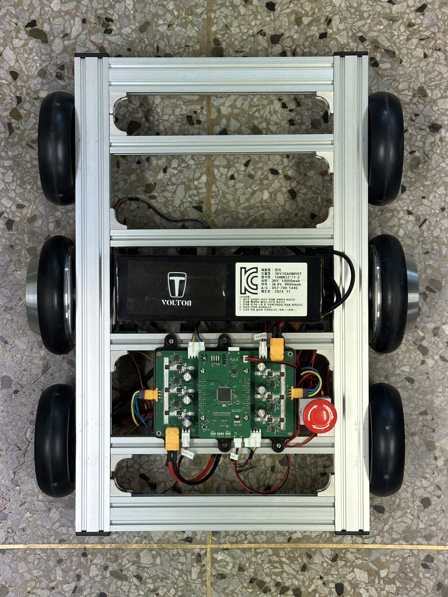
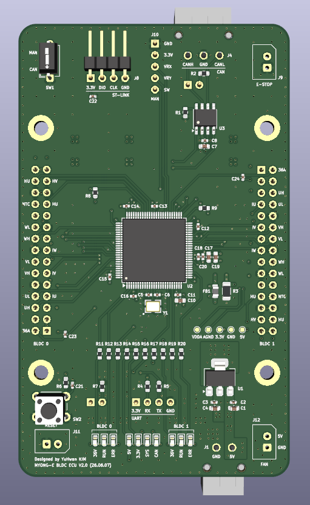
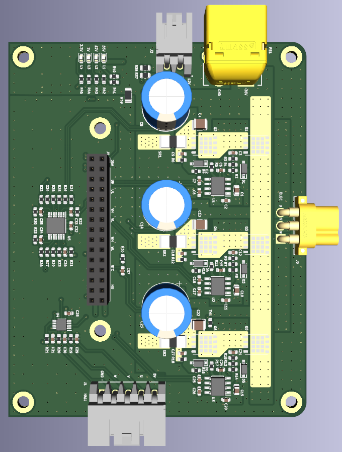

# BLDC ECU (2 ch Motor Driver)

A STM32G473-based 2-channel BLDC motor driver ECU for an autonomous park-cleaning robot.
Designed for ROS2 Nav2 integration via CAN. Self-designed PCB, schematics, and firmware. (Capstone Project)

---

<p align="center">
  
  
</p>

---

## Features

- **2-Channel BLDC** — Independent Hall-sensor-based 6-step commutation for M0 and M1
- **Dual Control Mode** — CAN mode (ROS2 speed command) / Manual mode (joystick or fixed RPM)
- **CAN Interface** — FDCAN1 at 500 kbps, ROS2 Nav2 compatible frame format
- **Speed Control** — Open-loop ramp with PI closed-loop option per motor
- **Joystick Steering** — 4-zone discrete differential steering (forward / turn left / turn right / stop)
- **E-stop** — Hardware brake via BKIN pin (fail-safe: fires on wire break)
- **Protection** — Overcurrent (10 ms trip), overheat (NTC), undervoltage, Hall fault

### Status

| Feature | Status |
|---------|--------|
| 6-step Hall commutation | Done |
| Dual control mode (CAN / Manual) | Done |
| Joystick differential steering | Done |
| E-stop (BKIN fail-safe) | Done |
| Overcurrent / overheat / undervoltage protection | Done |
| ROS2 Nav2 integration | Done |
| PI closed-loop speed control | In progress |
| CAN communication (CANable) | In progress |

---

## Repository Structure

```
BLDC_ECU/
├── FW/
│   └── F473VET6/
│       └── BLDC_FW_V0.0.1/
│           ├── Core/
│           │   ├── Inc/
│           │   │   ├── bldc_config.h
│           │   │   ├── bldc_motor.h
│           │   │   ├── bldc_hall.h
│           │   │   ├── bldc_adc.h
│           │   │   ├── bldc_can.h
│           │   │   ├── bldc_mgr.h
│           │   │   └── bldc_led.h
│           │   └── Src/
│           │       ├── bldc_motor.c
│           │       ├── bldc_hall.c
│           │       ├── bldc_adc.c
│           │       ├── bldc_can.c
│           │       ├── bldc_mgr.c
│           │       └── bldc_led.c
│           └── Drivers/
└── HW/
    ├── BLDC_DRIVER/
    └── BLDC_ECU/
```

---

## Bill of Materials (BOM)

### ECU Board

| Component | Model |
|-----------|-------|
| MCU | STM32G473VET6 |
| CAN Transceiver | SN65HVD230 |
| Regulator | AMS1117-3.3 |
| Crystal | X322516MLB4SI |

### Driver Board

| Component | Model |
|-----------|-------|
| Gate Driver | UCC27211D |
| NMOS | BSC014N06NS (60V / 100A) |
| Schmitt Trigger | SN74LVC3G17DCTR |
| Op-Amp | TLV2374IPWR |
| Shunt Resistor | PA2512FKE7T0R002E (2 mΩ) |
| NTC Thermistor | NTCS0603E3103FLT (10 kΩ) |

---

## Hardware

### PCB

| Board | Size | Layers | Design Files |
|-------|------|--------|--------------|
| ECU | 100 × 60 mm | 4 | [HW/BLDC_ECU/](HW/BLDC_ECU/) |
| Driver | 80 × 100 mm | 4 | [HW/BLDC_DRIVER/](HW/BLDC_DRIVER/) |

<p align="center">
  
  
</p>

---

## Software

### System Diagram

```
  ┌───────────┐       CAN 0x200 CMD       ┌──────────────────────────┐
  │  ROS2     │ ─────────────────────────►│                          │
  │  Nav2     │◄───────────────────────── │       STM32G473          │◄─── E-stop (BKIN)
  └───────────┘  CAN 0x210/0x211 STATUS   │                          │
                                          │  FDCAN1  │  Scheduler    │
  ┌───────────┐  JOY X/Y  (ADC5)          │  PI Ctrl │  20kHz ISR    │
  │ Joystick  │ ─────────────────────────►│  Commutation / Protect.  │
  │  (Debug)  │                           └────────┬──────────┬──────┘
  └───────────┘                             PWM M0 │          │ PWM M1
                                  ┌────────────────▼──┐  ┌───▼────────────┐
                                  │    Bridge  M0     │  │   Bridge  M1   │
                                  └────────┬──────────┘  └──────┬─────────┘
                                           │                    │
                                  ┌────────▼──────────┐  ┌──────▼─────────┐
                                  │    Motor  M0      │  │   Motor  M1    │
                                  │   (Left Wheel)    │  │ (Right Wheel)  │
                                  └────────┬──────────┘  └───────┬────────┘
                                           │  Hall / Current     │
                                           └──────────┬──────────┘
                                                      │
                                         Feedback to 20kHz ISR
                                        Hall: TIM3/TIM4  Current: ADC1~4
```

### Architecture

Single-MCU, bare-metal with a HAL-tick software scheduler. No RTOS — the 20 kHz commutation ISR requires deterministic latency.

| Task Period | Content |
|-------------|---------|
| 20 kHz ISR (TIM8 / TIM1) | Commutation, E-stop guard, stall kick, overcurrent, open-loop ramp |
| Hall ISR (TIM3 / TIM4) | RPM calculation, immediate commutation update |
| 1 ms | Current sampling (ADC1~4), PI speed controller |
| 10 ms | Bus voltage + NTC (ADC5), undervoltage / overheat protection, LEDs |
| 100 ms | CAN status TX (0x210 / 0x211), RX watchdog |

### CAN Frame Format (500 kbps, Classic CAN)

**RX — ROS2 → ECU**

| ID | DLC | Byte | Content |
|----|-----|------|---------|
| 0x200 CMD_SPEED | 8 | B[0:1] | M0 RPM ref — int16 LE, LSB = 0.1 RPM |
| | | B[2:3] | M1 RPM ref — int16 LE, LSB = 0.1 RPM |
| | | B[4] | M0 direction (0=CCW / 1=CW) |
| | | B[5] | M1 direction (0=CCW / 1=CW) |
| | | B[6] | Enable flags (bit0=M0, bit1=M1) |
| 0x201 CMD_CTRL | 2 | B[0] | bit0=M0 clear fault, bit1=M1 clear fault, bit2=M0 PI, bit3=M1 PI |

**TX — ECU → ROS2 (100 ms)**

| ID | DLC | Byte | Content |
|----|-----|------|---------|
| 0x210 STATUS_M0 | 8 | B[0:1] | Actual RPM — int16 LE, LSB = 0.1 RPM |
| 0x211 STATUS_M1 | | B[2:3] | Max phase current — int16 LE, LSB = 0.01 A |
| | | B[4] | Temperature — int8, LSB = 1 °C |
| | | B[5] | Fault code (0=none, 1=OC, 2=overheat, 3=undervolt, 4=BKIN, 5=Hall) |
| | | B[6] | Flags (bit0=enabled, bit1=PI, bit2=spinning) |

---

## Build

**Requirements:** [STM32CubeIDE]

```
1. File → Import → Existing Projects into Workspace
2. Select: FW/F473VET6/BLDC_FW_V0.0.1
3. Build (Ctrl+B) → Flash via ST-Link
```

### Key Config (`bldc_config.h`)

| Macro | Default | Description |
|-------|---------|-------------|
| `BLDC_VOLTAGE_PROFILE` | `36` | System voltage: `12` or `36` |
| `BLDC_ACTIVE_MOTOR_COUNT` | `2` | `0`=no HW / `1`=M0 only / `2`=M0+M1 |
| `BLDC_JOY_ENABLE` | `0` | `0`=fixed RPM / `1`=joystick steering |
| `BLDC_NONCAN_FIXED_RPM` | `200.0` | Manual mode fixed RPM |
| `BLDC_HW_CURRENT_SENSING` | `1` | Disable if shunt not connected |
| `BLDC_HW_NTC` | `1` | Disable if NTC not connected |

---

Copyright (c) 2026 Kim Yuhwan
